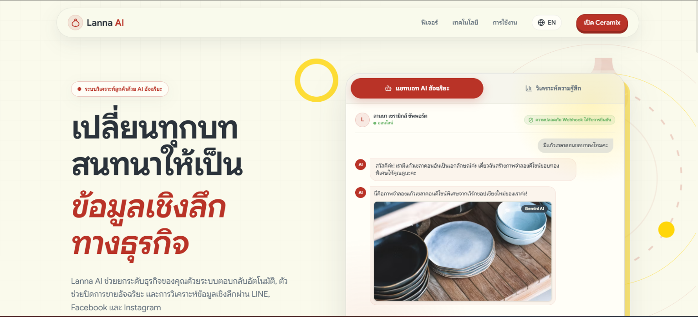

# 🎨 Lanna AI  – Landing Page

Landing Page สำหรับโครงการ **Lanna AI**
## website depoly on : [https://lanna-ai.com/](https://lanna-ai.com/)

## 🚀 Getting Started

### Prerequisites

* **Node.js** เวอร์ชัน 20.x ขึ้นไป
* **npm** (Node Package Manager)

---

### Installation

1. Clone Repository

```bash
git clone https://github.com/AI-for-ART-Ceramic/landingpage.git
cd landingpage
```

1. Install Dependencies

```bash
npm install
```

---

## 🔑 Environment Variables

คัดลอกไฟล์ตัวอย่างก่อนเริ่มพัฒนา:

```bash
cp .env.example .env.local
```

| ตัวแปร | คำอธิบาย |
| --- | --- |
| `NEXT_PUBLIC_VERSION` | เวอร์ชันของแอปที่แสดงผล (ตั้งค่าอัตโนมัติจาก git tag ตอน deploy) |
| `NEXT_PUBLIC_EVALUATION_FORM_URL` | ลิงก์ Google Form สำหรับเมนู "การประเมิน" ใน Navbar |

> ตัวแปรที่ขึ้นต้นด้วย `NEXT_PUBLIC_` จะถูกฝังเข้าไปใน production build ตอน `npm run build` ดังนั้นเวลา deploy ผ่าน Docker/CI ต้องส่งค่าเป็น build-arg (ดูหัวข้อ [🚢 Deployment](#-deployment))

---

## 💻 Development

เริ่มต้น Development Server:

```bash
npm run  dev
```

เปิดเบราว์เซอร์ที่
👉 [http://localhost:3000](http://localhost:3000)

สามารถแก้ไขหน้าเว็บได้ที่ไฟล์
`src/app/page.tsx`
ระบบจะ **Hot Reload / Auto Update** ทันทีเมื่อมีการแก้ไขไฟล์

---

### Available Scripts

* `npm run dev` – รัน Development Server
* `npm run build` – Build สำหรับ Production
* `npm run start` – รัน Production Server
* `npm run lint` – ตรวจสอบคุณภาพโค้ดด้วย ESLint
* `npm run test` – รัน Unit Tests ด้วย Vitest
* `npm run format` – จัดรูปแบบโค้ดด้วย Prettier

---

## 📦 Production Build

Build แอปพลิเคชันสำหรับ Production:

```bash
npm run build
```

ไฟล์ที่ผ่านการ Optimize แล้วจะถูกสร้างในโฟลเดอร์ `.next`

### ทดสอบ Production Build บนเครื่อง

```bash
npm run start
```

Production Server จะรันที่
👉 [http://localhost:3000](http://localhost:3000)

---

## 🚢 Deployment

### Deploy อัตโนมัติผ่าน GitHub Actions

Production deploy ทำผ่าน workflow `.github/workflows/docker-publish.yml` ไม่ใช่ Vercel:

* **Trigger:** push git tag ที่ขึ้นต้นด้วย `v` (เช่น `git tag v0.2.0 && git push --tags`) หรือรันเองผ่าน `workflow_dispatch`
* **Job `build`** (GitHub-hosted runner): build Docker image พร้อม build-args `NEXT_PUBLIC_VERSION` (มาจากชื่อ tag) และ `NEXT_PUBLIC_EVALUATION_FORM_URL` (มาจาก GitHub Actions repository variable) แล้ว push ขึ้น GHCR (`ghcr.io/<owner>/<repo>`)
* **Job `deploy`** (self-hosted runner): pull image ล่าสุด, หยุด/ลบ container `landingpage-app` เดิม, รัน container ใหม่ที่พอร์ต `3030`, ตรวจสอบด้วย health check ก่อนจบงาน

> ต้องตั้งค่า repository variable ชื่อ `NEXT_PUBLIC_EVALUATION_FORM_URL` ไว้ที่ Settings → Secrets and variables → Actions → Variables ก่อน deploy ครั้งแรก

---

## 🛠️ Tech Stack

* **Framework:** Next.js 16.1.6
* **Language:** TypeScript 5
* **UI Library:** React 19.2.1
* **Styling:** Tailwind CSS 4
* **Animation:** Framer Motion 12, GSAP + @gsap/react
* **Icons:** Lucide React
* **Utilities:** clsx, tailwind-merge
* **Testing:** Vitest, Testing Library, jsdom
* **Linting:** ESLint 9 + Prettier
* **Git Hooks:** Husky + lint-staged

---

## 🗂️ Project Structure

```bash
landingpage/
├── .github/workflows/           # CI/CD (docker-publish.yml)
├── .husky/                      # Git hooks
├── docs/images/                 # README screenshots
├── public/                      # Static assets
├── scripts/                     # One-off scripts (shot.mjs)
├── src/
│   ├── app/                     # Next.js App Router
│   │   ├── page.tsx             # Home page
│   │   ├── layout.tsx           # Root layout
│   │   ├── globals.css          # Global styles
│   │   ├── privacy-policy/      # Privacy Policy page
│   │   └── terms-of-service/    # Terms of Service page
│   ├── components/              # Reusable React components
│   │   ├── sections/            # Section components
│   │   │   ├── Features.tsx
│   │   │   ├── Footer.tsx
│   │   │   ├── Hero.tsx (+ Hero.test.tsx)
│   │   │   ├── Navbar.tsx
│   │   │   ├── TechStack.tsx
│   │   │   └── UseCases.tsx
│   │   └── visuals/              # Decorative visual components (+ tests)
│   │       ├── CeramicVisuals.tsx
│   │       └── SectionDivider.tsx
│   ├── hooks/                    # Custom React hooks
│   │   └── useGsapReveal.ts
│   ├── i18n/                     # Language context & translations
│   │   ├── LanguageContext.tsx
│   │   └── translations.ts
│   ├── lib/                      # Utilities & constants
│   │   ├── constants.ts
│   │   └── utils.ts
│   ├── styles/                   # CSS partials (per section)
│   └── test/                     # Vitest setup
│       └── setup.ts
├── .env.example                  # Environment variable template
├── .prettierrc                   # Prettier configuration
├── Dockerfile                    # Docker configuration
├── eslint.config.mjs             # ESLint configuration
├── next.config.ts                # Next.js configuration
├── postcss.config.mjs            # PostCSS configuration
├── tsconfig.json                 # TypeScript configuration
├── vitest.config.ts              # Vitest configuration
└── package.json                  # Scripts & dependencies
```

## 🐳 Docker Deployment (Local Testing)

สำหรับทดสอบ Docker build บนเครื่องตัวเองเท่านั้น — production ใช้ pipeline อัตโนมัติตามหัวข้อ [🚢 Deployment](#-deployment) ด้านบน

### Build Docker Image

Build image with name: `landingpage:0.1.0`

```bash
docker build -t landingpage:0.1.0 .
```

### Run Docker Container

Run container with name: `landingpage_container`

```bash
docker run -d -p 3050:3000 --name landingpage_container landingpage:0.1.0
```

เข้าถึงแอปพลิเคชันได้ที่:
👉 [http://localhost:3050](http://localhost:3050)
---

## 📝 License

This project is private and proprietary.

---

## 💬 Support

หากมีปัญหาหรือคำถาม กรุณาติดต่อทีม Lanna AI

---

**Built with ❤️ by Lanna AI Team**
